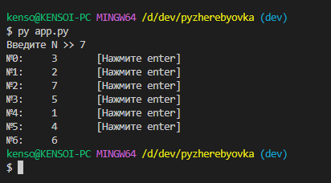
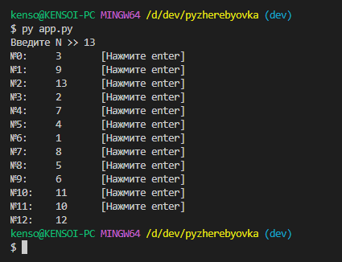
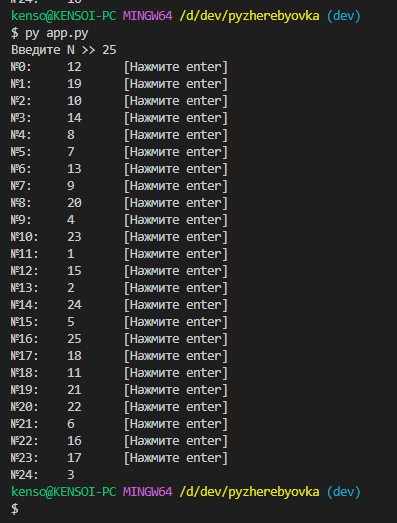

# Программа жеребьёвки
*Автор программы* - Прокофьев Андрей Фт-210008  
*Описание* - Программа, предназначенная для проведения жеребьёвки методом генерации случайных чисел  

* app.py - основной функционал программы
* logger.py - скрипт с логгером
* .log - созданный логгером лог

# Запуск
Для запуска программы требуется Python версии 3.10 и выше

```bash
python3 app.py
```

# Скриншоты



